# SubLodeX

<p align="center">
  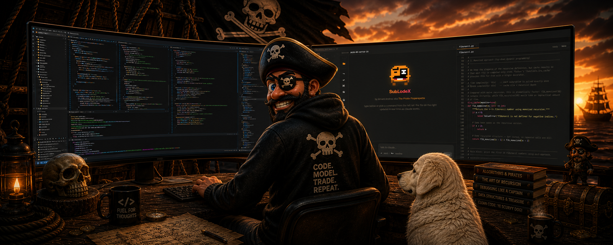
</p>

<h3 align="center">A local-first desktop app for Claude Code</h3>
<p align="center"><em>It feels like a dev environment that happens to have an AI inside, not a chat with code stapled on the side.</em></p>

Multi-project workspace, live file streaming, integrated terminal (local + SSH), git tooling, and per-project chat sessions — all in one window.

<p align="center">
  <a href="docs/img/03-live-streaming.mp4">
    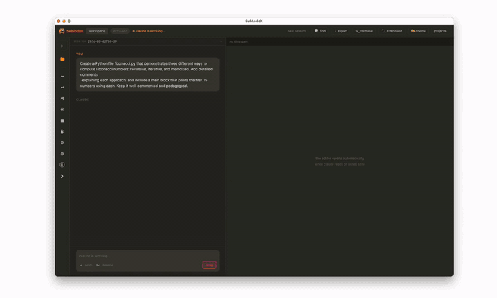
  </a>
  <br />
  <strong>This isn't a wrapper.</strong> The editor on the right shows the file being written, character by character, while Claude generates it. <em>Click for the higher-quality MP4.</em>
</p>

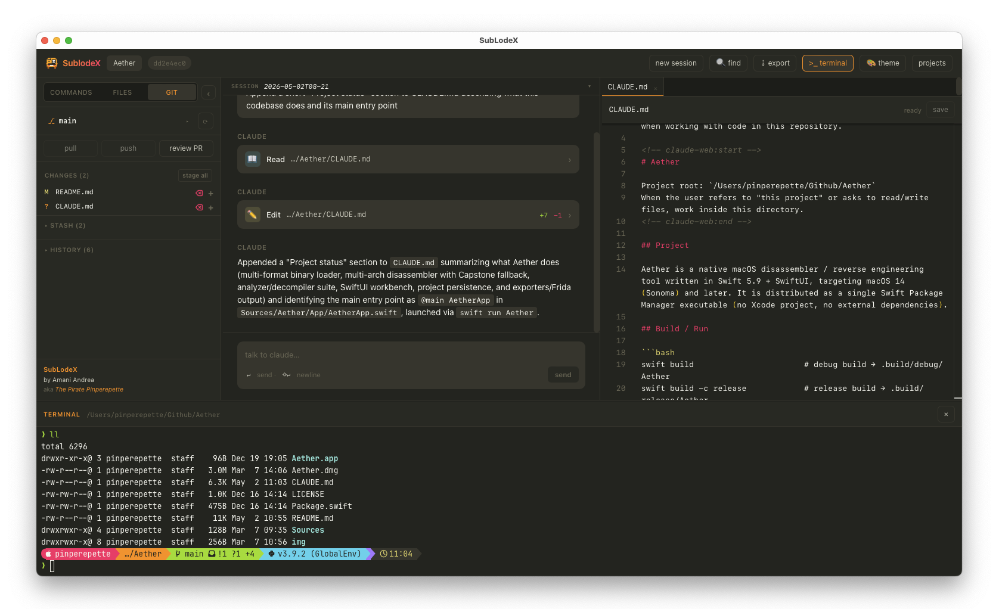

---

## What it does (in one paragraph)

You point SubLodeX at a folder (local or remote via SSH). Claude shows up as a chat in the middle of the window. When Claude reads or writes a file, the editor on the right opens that file and **shows the changes appear character by character**. The left sidebar gives you the file tree, the project commands (`/init`, `/cost`, `/permissions`, …), and a full git panel. The terminal at the bottom is a real PTY — local shell or `ssh user@host` depending on the project. Conversations are persisted, scoped per project, and you can have multiple parallel chat sessions on the same project. Themes are real themes — Monaco, xterm, and the UI all change together.

---

## Install (binary, recommended)

> Pre-built bundles will be on the [Releases page](../../releases) for macOS (Intel + Apple Silicon), Linux (`.deb` / `.AppImage` / `.rpm`), and Windows (`.msi` / `.exe`).

After download, on **macOS**:

1. Drag `SubLodeX.app` into `/Applications/`.
2. The app is unsigned. First launch needs Gatekeeper bypass:

   ```bash
   xattr -dr com.apple.quarantine /Applications/SubLodeX.app
   ```

   Or right-click → *Open* → confirm.

On **Linux**: `sudo dpkg -i SubLodeX_*.deb` (Debian/Ubuntu), or `chmod +x SubLodeX_*.AppImage && ./SubLodeX_*.AppImage`.

On **Windows**: run the `.msi`. SmartScreen will warn (unsigned) — *More info → Run anyway*.

### Runtime requirements

The bundle ships **everything**:

* its own Bun runtime (sidecar binary, ~70 MB)
* the bundled `server.ts` (single `.mjs` file)
* the native `claude` binary (~217 MB — yes, that's why the `.app` is ~293 MB)
* a Rust-native PTY (`portable-pty`) — no Node, no `node-pty`, no extra installs

The only **optional** runtime dependency:

* `sshpass` — only if you want SSH password authentication for remote projects. Key-based / agent SSH works without it. (`brew install sshpass` / `apt install sshpass`).

---

## Authentication

SubLodeX uses your existing Claude credentials:

1. **Subscription (recommended)** — log in once with the `claude` CLI:

   ```bash
   claude          # then: /login
   ```

   SubLodeX picks up the token from:
   * macOS Keychain
   * `~/.claude/.credentials.json` on Linux / Windows

   **No `claude` CLI installed?** The bundle already ships one. Use it directly or symlink it into your `$PATH`:

   ```bash
   # macOS (after installing /Applications/SubLodeX.app)
   sudo ln -s /Applications/SubLodeX.app/Contents/Resources/_up_/resources/claude-bin/claude /usr/local/bin/claude
   claude /login

   # Linux (after installing the .deb)
   sudo ln -s /usr/lib/SubLodeX/resources/claude-bin/claude /usr/local/bin/claude
   claude /login

   # Windows: the binary is at
   #   %ProgramFiles%\SubLodeX\resources\claude-bin\claude.exe
   # add that folder to your PATH or call it directly with full path
   ```

   On Linux, calling the binary by full path will fail with `Executable not found in $PATH: "claude"` because it self-respawns through `$PATH`. The symlink (or a `PATH` prepend) fixes it.

2. **API key** — set `ANTHROPIC_API_KEY` and start with `CLAUDE_WEB_USE_API_KEY=1`. By default the API key is **ignored** when subscription credentials are present, so subscription wins.

---

## Tour

### Project picker

Multi-project workspace. Each project has its own path (local or SSH), its own conversations, its own settings. You switch with one click and *everything* follows: file tree, terminal, chat, git state.

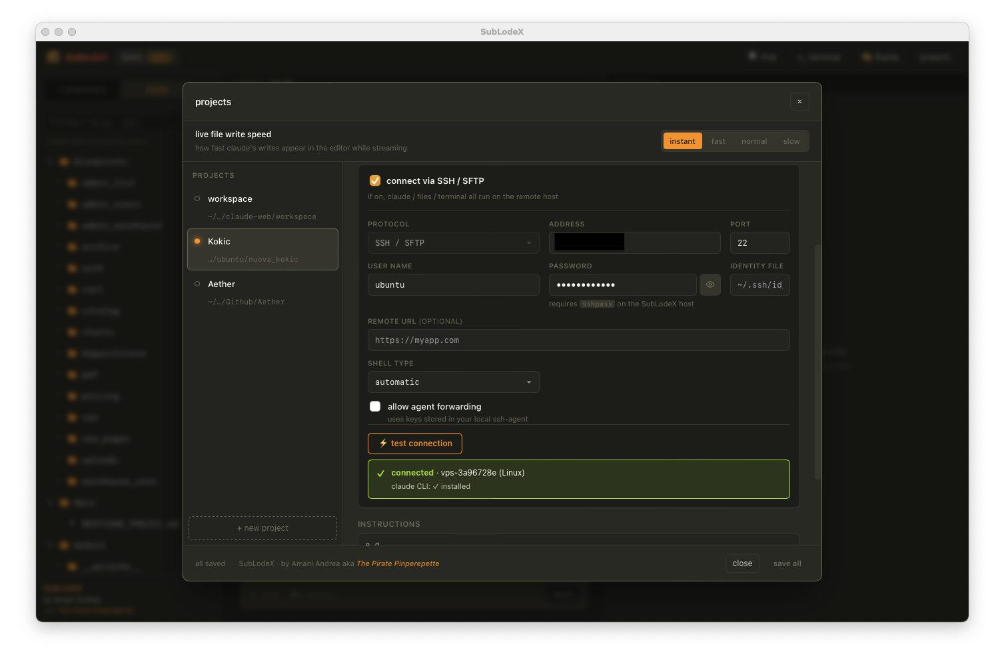

### Live file streaming

When Claude calls `Write` or `Edit`, the editor opens that file and writes it character by character, in real time. Not "here's the code, paste it" — you watch it happen.

There's a **speed regulator** because at full speed you barely see it:

* `instant` — no animation, full speed (default)
* `fast` — ~330 char/s
* `normal` — ~100 char/s
* `slow` — ~33 char/s, true typewriter

Set it from *projects → live file write speed*. *(see the GIF at the top of this README for a demo)*

### Real terminal (local + SSH)

PTY backed by Rust `portable-pty`. Bytes streamed to xterm.js via Tauri Channel — no Node helper, no SIGHUP wrangling, no node-pty native modules to ship per platform. SSH sessions reuse a `ControlMaster` socket with the file-ops connection, so the second pane / file open / git op opens in ~10 ms instead of ~300 ms.

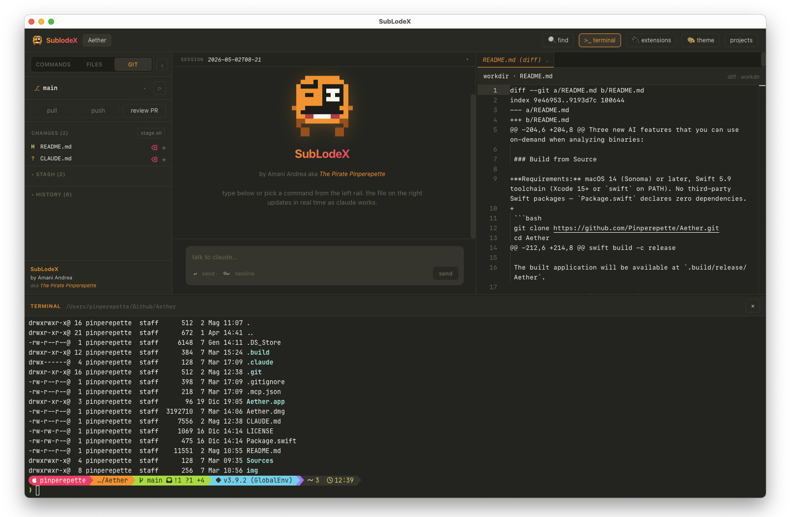


### Multi-session per project

One project can have N parallel chat sessions. Use them for: bug fix vs new feature, daily threads, "spike I might come back to", onboarding vs implementation. Each session has its own Claude `session_id` so `--resume` keeps working independently.

The session bar above the chat shows the current session, summary of the first user message, and lets you switch / create / delete.

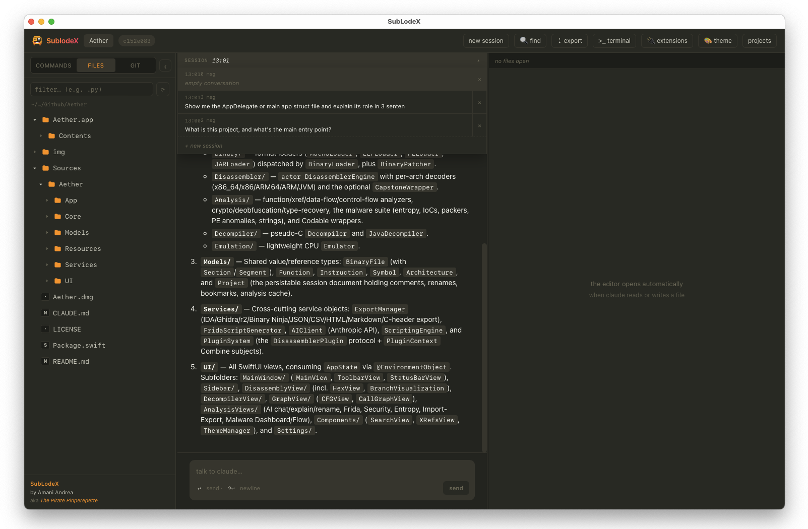

### Git panel

A full git panel in the sidebar (only appears if the project is a repo).

* current branch + ahead/behind counts
* branch switcher (checkout existing or `-b` new)
* dirty files split into **staged** / **changes** with `M` / `A` / `D` / `?` markers
* `+` to stage, `−` to unstage, `⌫` to discard (with confirm — for untracked files = `git clean -f`)
* **stage all** / **unstage all** buttons in section headers
* commit message + commit
* pull / push (disabled when ahead/behind = 0)
* **history** of last 30 commits — click any → editor opens `git show <hash>` in diff highlighting
* **stash** save / pop / drop
* **PR review** — paste a GitHub PR url or `#number`, the app does `git fetch origin pull/N/head:pr-N` and opens the diff vs the default branch in the editor
* every operation's stdout/stderr appears in a small drawer (`pull` showing changed files, `push` showing rejection reason, etc.)

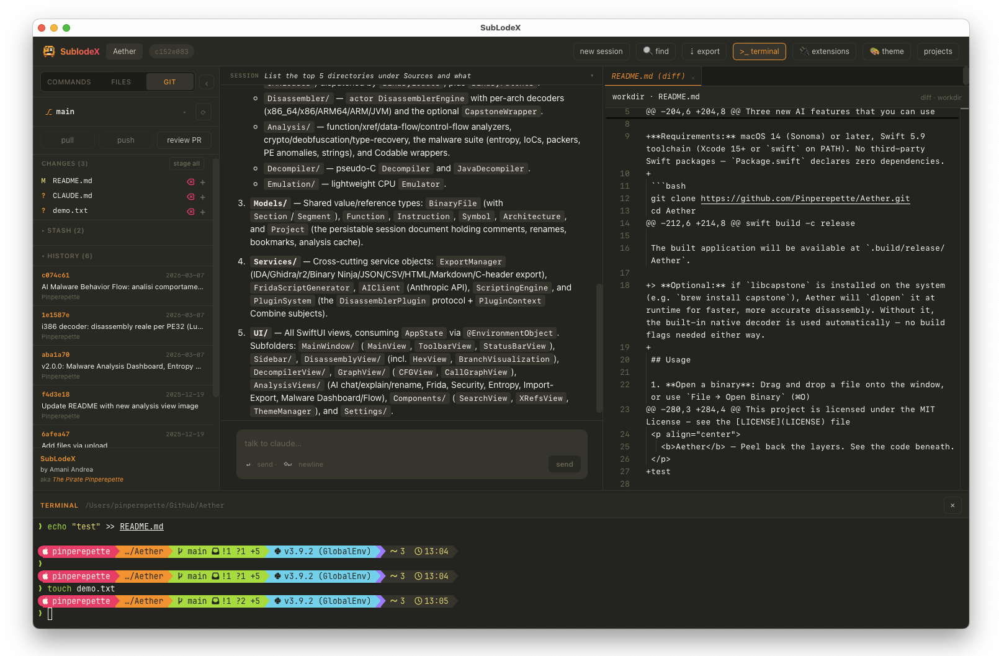

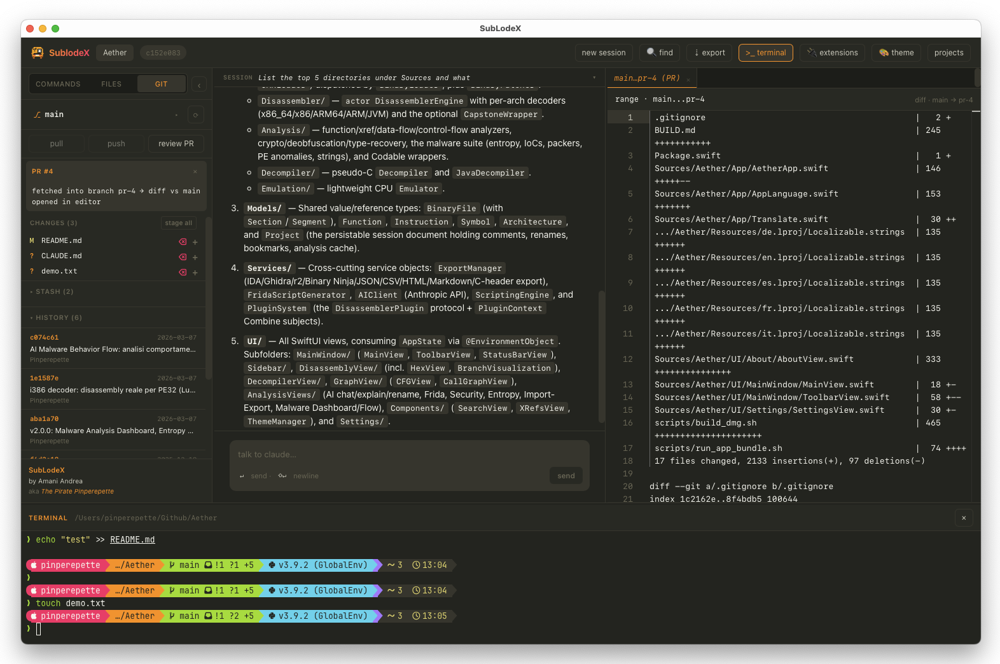

### Quick open (⌘P / ⌘K)

VS Code-style fuzzy finder. Press ⌘P (or ⌘K, or click the *find* button in the header), type 2-3 chars, hit ↵. Subsequence matching, basename bonus.

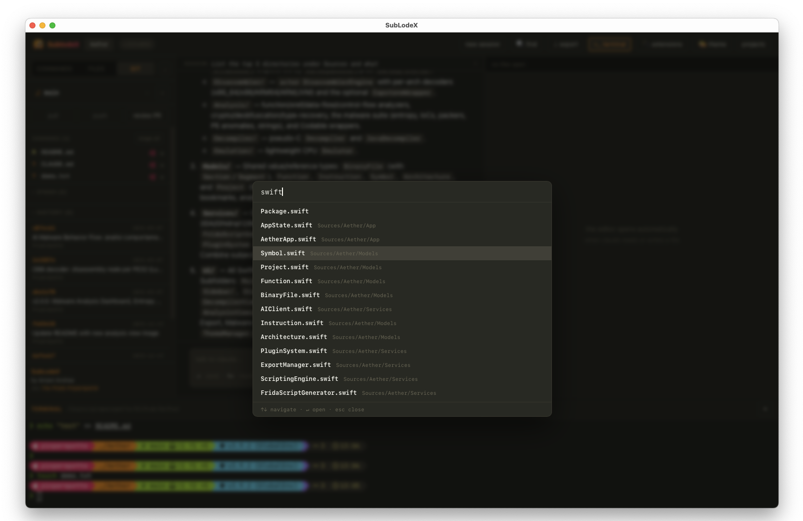

### Conversation export

The `⇣ export` button (visible only when the chat has messages) saves the conversation as a markdown file. Tool calls are expanded with their input + result. Useful for sharing debug sessions or saving "how I solved X" memos.

### Theme system

7 built-in themes:

* Monokai (default)
* Dracula
* Nord
* Tokyo Night
* One Dark
* Solarized Dark
* GitHub Light

Themes are **scoped per area** — you can mix. Editor in Monokai, terminal in Dracula, sidebar in Nord. Useful when one area has bad contrast against the other.

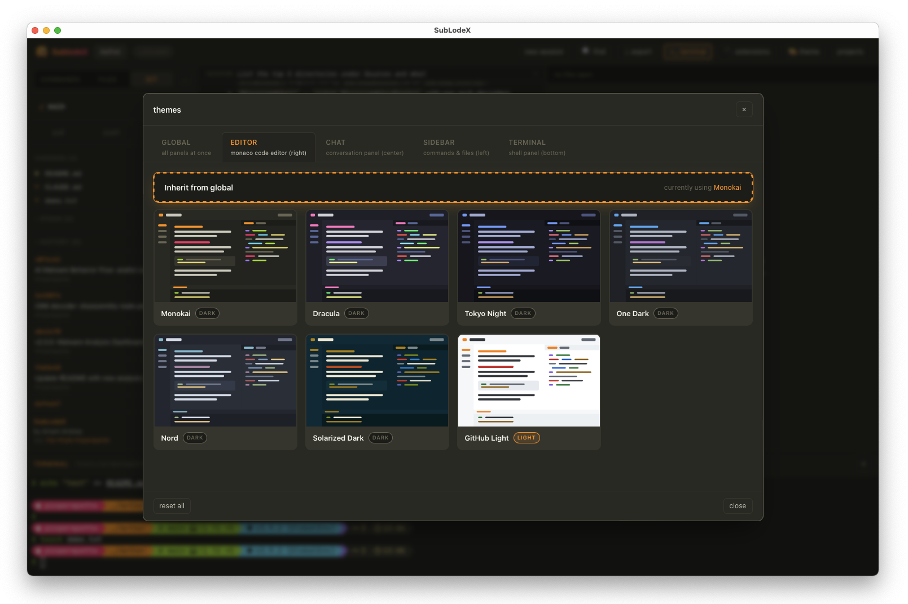

### Commands sidebar

Native Claude slash commands (`/init`, `/permissions`, `/cost`, …) wired up in the left rail. Click → sent to Claude. There's also a small set of UI-only commands (settings, etc.).

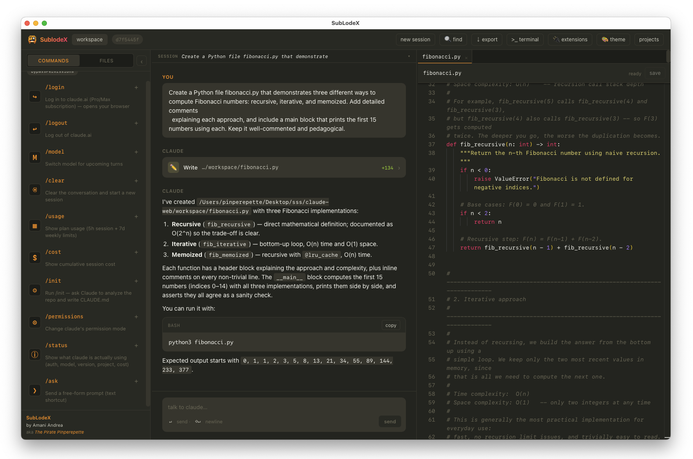

### Extensions panel

A read-only viewer for what's hooked into your Claude Code:

* **Plugins** — installed Claude Code plugins from `~/.claude/plugins/installed_plugins.json`, with their manifest, capabilities (commands / agents / skills / hooks / MCP / LSP), version, scope.
* **Extensions** — auto-detected: npm packages installed globally that hook into Claude Code (e.g. `@ccplug/claude-reforge`). Inferred from hook command paths.
* **MCP servers** — global (`~/.claude/settings.json`) + project (`.mcp.json`).
* **Hooks** — grouped by event (`PreToolUse`, `UserPromptSubmit`, …), with matcher and command visible.
* **Marketplaces** — registered plugin sources.

Read-only: install / enable / remove via the official `claude plugin` CLI.

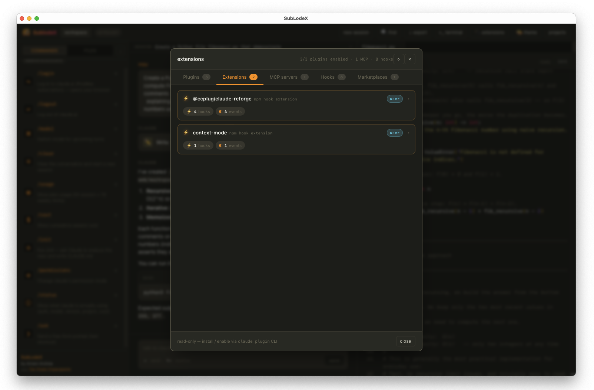

---

## Remote projects (SSH)

Point a project at a remote and everything runs there:

* `~/.ssh/config` host names autocompleted when adding a project
* password, identity file, or agent forwarding
* connection reuse via `ControlMaster`
* file tree, file open/save, terminal, claude — all over SSH

Claude runs *on the remote* (uses the remote's `claude` CLI). The local app proxies the conversation. **No per-character live streaming when editing remote files** — this is a **Claude CLI limitation**, not ours: the CLI's stream-json output doesn't emit partial tool input the way the local SDK does. Tool results still arrive (you see the diff after the tool returns), just no typewriter animation during the write.

(See `02-projects.png` above for the SSH form.)

---

## Build from source

### Prerequisites

* [Bun](https://bun.sh) ≥ 1.3
* [Rust](https://rustup.rs/) (stable) — required by Tauri
* macOS / Linux / Windows

```bash
# macOS via Homebrew
brew install bun rustup-init
rustup-init -y
```

```bash
# Ubuntu 22.04+
sudo apt-get install -y \
  libwebkit2gtk-4.1-dev libappindicator3-dev librsvg2-dev patchelf \
  build-essential
curl -fsSL https://bun.sh/install | bash
curl --proto '=https' --tlsv1.2 -sSf https://sh.rustup.rs | sh
```

```powershell
# Windows (PowerShell)
winget install -e --id Rustlang.Rustup
irm bun.sh/install.ps1 | iex
```

### Clone & install

```bash
git clone <this repo>
cd claude-web
bun install
```

### Run (dev)

```bash
bun run dev          # bun server :3001 + vite :5173
```

Open http://localhost:5173 in any browser. Vite has HMR; for the desktop window use:

```bash
bun run tauri:dev
```

> The Tauri window in dev still loads from `:3001` (the bundled URL). If you change frontend code, run `bun run build` to refresh the static bundle the desktop window sees. For pure UI hacking, use the browser at `:5173` — much faster cycle.

### Build a self-contained bundle

```bash
# (one-time per machine) download bun for the current arch
mkdir -p src-tauri/binaries
curl -fsSL https://github.com/oven-sh/bun/releases/latest/download/bun-darwin-x64.zip -o /tmp/bun.zip
unzip -oq /tmp/bun.zip -d /tmp
cp /tmp/bun-darwin-x64/bun src-tauri/binaries/bun-x86_64-apple-darwin
chmod 755 src-tauri/binaries/bun-x86_64-apple-darwin

bun run tauri:build
```

Output ends up in `src-tauri/target/release/bundle/`. On macOS:

```bash
cp -R src-tauri/target/release/bundle/macos/SubLodeX.app /Applications/
xattr -dr com.apple.quarantine /Applications/SubLodeX.app
```

For other targets, swap the bun zip URL:

| Target | bun zip | rust triple |
|---|---|---|
| macOS Apple Silicon | `bun-darwin-aarch64.zip` | `bun-aarch64-apple-darwin` |
| macOS Intel | `bun-darwin-x64.zip` | `bun-x86_64-apple-darwin` |
| Linux x64 | `bun-linux-x64.zip` | `bun-x86_64-unknown-linux-gnu` |
| Windows x64 | `bun-windows-x64.zip` | `bun-x86_64-pc-windows-msvc.exe` |

The `bun run tauri:build` script will:

1. `vite build` → `dist/`
2. `bun build server.ts --target=bun --outfile=src-tauri/resources/server.bundled.mjs`
3. copy `dist/`, the native `claude` binary, into `src-tauri/resources/`
4. compile the Rust shell, bundle as `.app` / `.dmg` / `.deb` / `.msi`

CI does the same per-platform — see `.github/workflows/release.yml`.

---

## Architecture

```
┌──────────────────────────────────────────────┐
│  Tauri WebView (React + Vite)                │
│  http://127.0.0.1:3001                       │
└────┬──────────────────────────────────┬──────┘
     │ REST /api/* + WebSocket /ws       │ Tauri invoke + Channel
     │                                   │
┌────┴──────────────────────────┐  ┌─────┴────────────────────┐
│  Bun server (sidecar)         │  │  Rust commands           │
│  • settings, file ops         │  │  • portable-pty manager  │
│  • git operations             │  │  • app data dir resolve  │
│  • SSH (sshExec)              │  │  • bun sidecar lifecycle │
│  • Claude SDK streaming       │  └──────────────────────────┘
└────┬──────────────────────────┘
     │ spawn
     ↓
   `claude` native binary (bundled)
   or remote `claude` over SSH
```

Why two communication channels? The Bun side is great at HTTP/WS and has the Claude SDK. The Rust side is great at native PTYs and process management. Splitting along that axis keeps each side doing what it's good at.

The native `claude` binary is bundled so the `.app` works on a clean machine (no `npm install` required for the user). On launch the Tauri Rust setup hook:

1. Resolves bundled paths (`server.bundled.mjs`, `dist/`, `claude` binary)
2. Computes the platform-specific app data dir
3. Spawns the Bun sidecar with all of these as env vars
4. Waits for `:3001` to come up before opening the window

Frontend ↔ PTY uses Tauri `Channel` (typed streaming), not events — events broadcast unreliably to webviews loaded from non-frontend URLs in Tauri 2.

---

## Data & persistence

Everything is local. The app data dir is platform-specific:

* macOS — `~/Library/Application Support/com.pinperepette.sublodex/`
* Linux — `~/.local/share/com.pinperepette.sublodex/`
* Windows — `%APPDATA%\com.pinperepette.sublodex\`

```
settings.json
conversations/<projectId>/<sessionId>.json
```

* per-project conversations, multiple sessions per project
* session resume supported (Claude `session_id` reused)
* no external storage, no telemetry, no analytics

When running from source (`bun run dev`), settings live in `<repo>/.data/` instead — dev runs don't touch your home dir.

---

## Limitations

* **no live streaming for remote edits** — Claude CLI limitation, not ours
* **remote file ops use shell** (cat/find/etc.) — no SFTP yet, so they're slower than they could be on big repos
* **passwords stored in plain text** in `settings.json`. Fine for localhost, but use SSH keys when possible
* **app is unsigned** — first launch needs `xattr` / right-click on macOS, SmartScreen confirmation on Windows

---

## Roadmap

* SFTP for remote file ops
* signed builds (macOS notarization, Windows code signing)
* better streaming for remote (claude runs locally + proxied tool ops)
* inline AI suggestions (Copilot-like, ghost text in editor)
* MCP server mode — expose SubLodeX's PTY/file/git as an MCP server for external Claude clients
* auto-updater (Tauri plugin)

---

## Status

Works well. The risky areas are the same areas any tool like this has:

* streaming partial JSON
* PTY lifecycle (Rust + portable-pty handles this much better than the old Node helper, but cross-platform PTYs are still cross-platform PTYs)
* SSH (`sshpass`, ControlMaster, key types, agent forwarding — many corners)

If it doesn't explode on first launch, you're probably fine.

---

## Author

SubLodeX — by **Amani Andrea** aka *The Pirate Pinperepette*.

---

## License

MIT — see [LICENSE](./LICENSE).

---

## Closing note

Once you get used to watching files write themselves, copy-pasting code from a chat feels broken.
